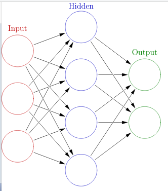

# dl - 深度学习进阶 - NLP

[书籍链接]([https://book.douban.com/subject/35225413/)

# 前言

## 主要内容

* 基于 Python 的文本处理
* DL 中的单词表示法
* 获取单词向量的 word2vec（CBOW 与 skip-gram）
* 加快大规模数据训练速度的 Negative Sampling
* 处理时序数据的 RNN、LSTM 与 GRU
* 处理时序数据的误差反向传播法
* 进行文本生成的神经网络
* seq2seq
* 关注重要信息的 Attention

## 使用的语言与库

* Python 3
* numpy
* matplotlib
* CuPy

PS:

* [100 numpy exercises](https://github.com/rougier/numpy-100)
* 

# 第一章 神经网络的复习

本书依然坚持"从零开始创建"，通过上手实践，探寻深度学习相关的乐趣。

## 1.1 数学与 Python 的复习

### 1.1.1 向量与矩阵

向量和矩阵分别可用一维数组和二维数组表示，如果推广到 N 维，则得到[张量](https://en.wikipedia.org/wiki/Tensor)。

在深度学习中，一般将向量作为**列向量**处理，本书则通常将其作为**行向量**处理。

```python
import numpy as np

x = np.array([1, 2, 3])
type(x), x.shape, x.ndim
# (numpy.ndarray, (3,), 1)

W = np.array([[1, 2, 3], [4, 5, 6]])
type(W), W.shape, W.ndim
# ((2, 3), 2)
```

### 1.1.4 向量内积和矩阵乘积

$x \cdot y = x_1y_1 + x_2y_2 + \cdots + x_ny_n$

向量内积是两个同样shape的向量的对应元素乘积之和，又称为点积、数量积，因其结果为标量。内积可直观地衡量两个向量夹角大小（除以向量大小之积后）。

矩阵乘积可视为内积的推广（左侧矩阵行向量与右侧矩阵列向量之积）。故而，两种乘积都使用 `np.dot` 函数。

```python
a = np.array([1, 2, 3])
b = np.array([4, 5, 6])
np.dot(a, b), a.dot(b)
# (32, 32)

A = np.array([[1, 2], [3, 4]])
B = np.array([[5, 6], [7, 8]])
# == A.dot(B)
np.dot(A, B)
# array([[19, 22],
#        [43, 50]])
```

### 1.1.5 矩阵形状检查

形状分别为 $m \cdot n$ 和 $n \cdot p$ 的矩阵之积为 $m \cdot p$，矩阵乘积对形状有严格要求。在深度学习中存在大量矩阵乘积，形状检查是一个简单而有效的调试方法。

## 1.2 神经网络的推理

### 1.2.1 神经网络推理全貌

神经网络中进行的处理分为学习和推理两部分，本节介绍推理部分。



上图为最简单的神经网络结构，输入层有3个神经元，隐藏层有4个，输出层有2个。圆圈表示”神经元“，箭头表示神经元之间的连接。箭头上带有”权重“，权重与对应神经元相乘，乘积之和（一般是经过激活函数变换后）作为下一个神经元的输入。此外，还要加上一个不受前一层神经元影响的常数，通常称为”偏置“。因为所有相邻神经元之间都存在”连接“，因此这样的神经网络又称为”全连接网络“。

上图中的网络，因为有三层，故有的文献称之为3层网络，而本书则称之为2层的，因其仅有2层（输入和隐藏）具有权重。上图之网络涉及术语：

* 神经元（neuron）
* 层（layer）
* 权重（weight）
* 偏置（bias）
* 全连接网络（fully connected network）

PS：上图从网络中寻得，但形状与书中不同，为保持一致，现假装该图三层神经元数量分别是：2、4、3。

用 $(x_1, x_2)$ 表示输入层数据，权重分别为 $w_{11}, w_{21}$，相应偏置为 $b_1$，则隐藏层第一个元素可以如此计算：

$$h_1 = x_1w_{11} + x2w_{21} + b_1$$

重复计算隐藏层其它神经元，发现基于全连接的变换可表示为矩阵乘积。

$$h = xW + b$$

形状说明：x 是 (1, 2)，W 是 (2, 4)，b 是 (1, 4)，如此，h 也是 (1, 4)。可以看到这里的向量都是”行向量“。这个乘积计算的是”一笔“数据，即一个输入。在 mini-batch 的情形下，输入可表示为矩阵。

在这一的表示下，x 的每一行表示一个**输入**，h 的每一行是对应**输入**产生的隐藏层。代码实现如下：

```python
W1 = np.random.randn(2, 4) # 权重
b1 = np.random.randn(4) # 偏置

x = np.random.randn(10, 2) # 10笔数据
h = np.dot(x, W1) + b1
```

#### 1.2.1.1 激活函数

按上节的计算方式，矩阵相当于对**输入**作了一个**线性变换**，如果没有其它操作介入，那么全连接网络也只是一个线性变换，这显然会拟合不足，弥补这一点的“其它操作”就是**激活函数**。常见的一个函数是**sigmoid 函数**：

$$\sigma(x) = \frac{1}{1 + exp(-x)}$$

```python
def sigmoid(x):
    return 1 / (1 + np.exp(-x))

a = sigmoid(h)
```

应用 sigmoid 激活 h 后，接下来是隐藏层到输出层，这时需要有类似的权重和偏置，shape 分别是 (4, 3) 和 (1, 3)。完整代码是：

```python
x = np.random.randn(10, 2)

# 到隐藏层
W1 = np.random.randn(2, 4)
b1 = np.random.randn(4)
h = np.dot(x, W1) + b1
a = sigmoid(h)

# 到输出层
W2 = np.random.randn(4, 3)
b2 = np.random.randn(3)
s = np.dot(a, W2) + b2
s.shape
# (10, 3)
```

使用矩阵表示后，繁琐的计算变得颇为简洁。这里的 s 即是输出层，每一行是一个“输出”，是3维向量。假设这是一个分类问题，3维对应3个分类的得分，那么得分最高的那个是分类结果。得分不是概率，通过把得分输入 Softmax 函数，可以转换为概率。

到这里，神经网络的**推理**部分实现了。

### 1.2.2 层的类化和正向传播

全连接层相当于几何学中的仿射变换（线性变换+平移，Affine transformation），因此全连接层实现为 `Affine` 层；将 sigmoid 函数的变换实现为 `Sigmoid` 层。

神经网络的推理相当于网络中的**正向传播**，而学习则对应**反向传播**。

在本书中，各种层实现为 Python 类，将它们模块化，之后则像乐高积木一样搭建网络。本书的实现有以下规范：

* 所有层都有 `forward()`、`backward()` 方法
* 所有层都有 `params`、`grads` 字段

params 保存权重与偏置，grads 保存参数对应的梯度。对于正向传播来说，仅关注以下两点：`forward()`、`params`。

下面的代码实现了两层网络的**推理**，看起来有点样子了。

```python
class Affine:
    def __init__(self, W, b):
        self.params = [W, b]

    def forward(self, x):
        w, b = self.params
        out = np.dot(x, w) + b
        return out


class Sigmoid:
    def __init__(self, params=None):
        if params is None:
            params = []
        self.params = params

    def forward(self, x):
        return 1 / (1 + np.exp(-x))


class TwoLayerNet:
    def __init__(self, input_size, hidden_size, output_size):
        I, H, O = input_size, hidden_size, output_size

        # 初始化权重与偏置
        w1 = np.random.randn(I, H)
        b1 = np.random.randn(H)
        w2 = np.random.randn(H, O)
        b2 = np.random.randn(O)

        # 生成层
        self.layers = [Affine(w1, b1),
                       Sigmoid(),
                       Affine(w2, b2)]

        self.params = []
        for layer in self.layers:
            self.params.extend(layer.params)

    def predict(self, x):
        for layer in self.layers:
            x = layer.forward(x)
        return x
        
        
if __name__ == '__main__':
    # predict by nn
    x = np.random.randn(10, 2)
    model = TwoLayerNet(2, 4, 3)
    scores = model.predict(x)
    print(scores.shape)
```

## 1.3 神经网络的学习

看起来，**推理**相对来说是简单的，**学习**才是困难的部分，而且先学习了才能真正进行推理。

### 1.3.1 损失函数（Loss Function）

在神经网络的学习中，为了评估学习效果如何，需要一个**指标**，通常使用的是**损失函数**。在处理多类别分类问题时常用的损失函数是**交叉熵误差（Cross Entropy Error）**。
/Users/mesoor/github/Programming/sml/intro/hello.md
### 1.3.2 导数和梯度

**神经网络的学习的目标**是找到使损失最小的参数。此时导数和梯度非常重要。

一元函数的导数容易理解，即函数变化率，多元函数对应的是偏导数。将多个变量的导数罗列在一起，得到**梯度（Gradient）**。另外，矩阵甚至也可以像向量一样求解梯度，其梯度维度与矩阵相同。

### 1.3.3 链式法则

神经网络的梯度求解用到**误差反向传播法**，其关键则是**链式法则**。借由链式法则，无论要处理的函数如何复杂，复合函数的导数总是可以求解。

可以认为：整个神经网络就是由多个函数复合而成的。

### 1.3.4 计算图

反向传播的计算需要用到**计算图**，求解梯度时，梯度沿与正向传播相反的方向传播，故称为反向传播。

最简单的计算图是两个节点之和，此时，上游导数沿分支反向传播。传播也不限于单变量，也可以用于向量、矩阵或张量。

* 加法节点
* 乘法节点
* 分支节点
* 复制节点（通用的分支节点）
* Sum 节点（通用的加法节点）

复制节点与 Sum 节点是逆向关系，两者的正向、反向操作相反。

# 1.3.4.5 MatMul 节点

矩阵乘积称为 MatMul 节点。通过计算，可以得到非常简洁的结果，若 $y = xW$（$x$为 N笔数据，shape 为 (N, D)，W 为权重矩阵，shape 为 (D, H)，y 的 shape 为 (N, H)：

$$\frac{\partial L}{\partial x} = \frac{\partial L}{\partial y} W^T,  \frac{\partial L}{\partial W} = x^T \frac{\partial L}{\partial y}$$

这是一个很优美的结果，它居然和乘法节点的结果类似。

### 1.3.5 梯度的推到和反向传播的实现

通过上述节点类型以及链式法则，常见的反向传播实现起来变得简单。比如 Sigmoid 层，全连接层 Affine 层和 Softmax with Loss 层。

以 Sigmoid 为例，$L(x) = L(y), y = sigmoid(x)$，需要求解的是 $\frac{\partial L}{\partial x}$，这可以通过链式法则直接求得，其 Python 实现也是“照搬”即可。

Affine 层则是 MatMul、Repeat、加法节点的组合。Softmax with Loss 是 Softmax 和 Cross Entropy Error 函数的组合。

### 1.3.6 权重的更新

通过反向传播法求出梯度后，下一步是利用梯度更新神经网络的参数，神经网络的学习按如下步骤进行：

1. mini-batch：从训练数据中随机抽取多笔数据
2. 计算梯度：计算损失函数关于各个参数的梯度
3. 更新参数：根据梯度更新权重参数
4. 重复：根据需要多次重复上述1-3步

步骤3中，更新权重的方法有很多，常见的是随机梯度下降法（SGD），随机是指使用随机选择的数据。SGD 的公式是：

$$W \leftarrow W - \eta \frac{\partial L}{\partial W}$$

$\eta$ 是学习率（learning rate），一般使用预先定义的值，如 0.01，0.001 等。更新权重的函数成为 optimizer，除了 SGD，常见的还有 AdaGrad、Adam 等。

## 1.4 使用神经网络解决问题

TODO

## 1.5 小结

通过计算图，我们可以仅关注局部，而在每个局部上，梯度的计算也变得简单许多。看起来非常复杂的的梯度求解问题就这样被化解了。

# 第二章 自然语言和分布式表示

本章探讨理解自然语言的古典方法，即深度学习出现之前的方法。

自然语言通常是指一种自然地随文化演化的语言，如汉语、英语。在 NLP 中的自然语言，通常是与人造语言相对的含义。人造语言包括编程语言或托尔金在魔戒中创造的中土世界的语言，如精灵语。

NLP，即让机器理解自然语言的技术。在 NLP 中，与自然语言相对的典型例子是编程语言，它与人类自然使用的语言有明显的差别。比如编程语言有唯一确定的语法和语义（否则程序无以执行），而自然语言显然不是这样的。而且，自然语言正在越来越快地演化，新词越来越多，旧词逐渐隐退。

NLP 技术已经应用在很多领域，如机器翻译、聊天机器人、问答系统和搜索引擎。问答系统的一个著名例子是 IBM 的 Watson。

## 2.1 词

从语义上来说，词（而非字）是最小的单位，因此理解词的含义是 NLP 最基本的事情。

本章主题是让计算机理解词的含义，主要是以下3种方法：

* 同义词词典
* 计数方法
* 推理方法（下一章的 word2vec）

第一种是人工方式，后两种是机器方式。

## 2.2 同义词词典

在 NLP 中，广泛使用的不是常规词典（如新华字典），而是**同义词词典（Theaurus）**。通过同义词，我们知道 car 的同义词有 automobile、motorcar 等。

同义词词典还会定义词之间的关系，如上位-下位，整体-部分关系等。通过这个关系网络，可帮助计算机理解词之间的关系。

NLP 中最著名的同义词词典是 WordNet。

以人工方式整理的同义词词典有如下问题：

* 更新不及时：如新词”众筹“（crowdfunding），新义（heavy-事态严重的）
* 人力成本高：英语中词的总数超过10M，而 WordNet 只收录了20余万（上次稳定版本还是2011年的）
* 无法表示词之间的微妙差异：粒度较粗

在数据量极大的情况下，企图以人工方式整理大量数据是不现实的，因此我们需要求助于机器自动完成，也就是后两种方法。

## 2.3 基于计数的方法

要使得机器自动完成，我们需要一定规模的**语料库（corpus）**。

语料库是一些“文本数据”，包含了人类写出的“文章”。可以说，语料库包含了大量的自然语言的“实践知识”，如词义、词的选择、句子组织等等。计数方法试图从挖掘出这些实践背后的语言知识。

### 2.3.1 语料库预处理

这里选择一个最简单的“语料库”来演示语料库的预处理过程。这个语料库只包含一个句子，以下代码包含预处理、分词和转换：

```python
def preprocess(sent):
    return sent.lower()
    
def word_seg(sent):
    sent = sent.replace('.', ' .')
    return sent.split(' ')

def transform_words(words):
    word_to_id = {}
    id_to_word = {}

    for word in words:
        if word in word_to_id:
            continue

        new_id = len(word_to_id)
        word_to_id[word] = new_id
        id_to_word[new_id] = word
    
    # 使用 id，将原始文本转换为 array
    corpus = [word_to_id[w] for w in words]
    corpus = np.array(corpus)
    return corpus, word_to_id, id_to_word

def transform(raw_text):
    sent = preprocess(raw_text)
    words = word_seg(sent)
    return transform_words(words)
    
text = 'You say goodbye and I say hello.'
corpus, word_to_id, id_to_word = transform(text)
print(corpus)  # [0 1 2 3 4 1 5 6]

word_to_id, id_to_word
```
结果是：

```
({'you': 0, 'say': 1, 'goodbye': 2, 'and': 3, 'i': 4, 'hello': 5, '.': 6},
 {0: 'you', 1: 'say', 2: 'goodbye', 3: 'and', 4: 'i', 5: 'hello', 6: '.'})
```

通过这段简单的代码，可以将原始的句子转换为 numpy array，即完成了最基本的向量化。

### 2.3.2 词的分布式表示

假设有100种颜色，要通过向量表示的话，一种选择是“one-hot”，那么向量需要是100维的，另一种选择是使用RGB，只需要3维。前一种表示很“稀疏”，而且无法了解不同向量之间的相似性，而后一种很紧凑，而且方便了解其相似性。

接下来，我们将会讨论如何得到包含了词义的紧凑的向量表示，在 NLP 中，这成为**分布式表示**。

### 2.3.3 分布式假设

在 NLP 中，用向量表示词的研究有很多，其中很多方法都基于一个简单的想法，即“一个词的含义由它周围的词定义”，这一想法称为**分布式假设**。

### 2.3.4 共现矩阵

对词的上下文词进行统计的方法。可使用如下代码获得共现矩阵：

```python
def create_co_matrix(corpus, vocab_size, window_size=1):
    corpus_size = len(corpus)
    co_matrix = np.zeros((vocab_size, vocab_size), dtype=np.int32)
    
    for word_i, word_id in enumerate(corpus):
        for i in range(1, window_size+1):
            left_i = word_i - i
            right_i = word_i + i
            if left_i >= 0:
                left_word_id = corpus[left_i]
                co_matrix[word_id, left_word_id] += 1
            if right_i < corpus_size:
                right_word_id = corpus[right_i]
                co_matrix[word_id, right_word_id] += 1
    
    return co_matrix
    
co_matrix = create_co_matrix(corpus, len(id_to_word))
```

### 2.3.5 向量间的相似度

这里使用余弦相似度：

```python
def cos_similarity(x, y, eps=1e-8):
    # 添加一个极小值，防止出现除以零错误
    nx = x / np.sqrt(np.sum(x**2) + eps)
    ny = y / np.sqrt(np.sum(y**2) + eps)
    return np.dot(nx, ny)
    
c1 = co_matrix[word_to_id['you']]
c2 = co_matrix[word_to_id['i']]
cos_similarity(c1, c2)  # 0.7071067758832467
```

### 2.3.6 相似词的排序（most_similar）

```python
def most_similar(query, word_to_id, id_to_word, word_matrix, top=5):
    if query not in word_to_id:
        # new word, no sims
        print(f'{query} is unknown')
        return []
    
    word_id = word_to_id[query]
    word_vec = word_matrix[word_id]
    
    vocab_size = len(id_to_word)
    sims = np.zeros(vocab_size)
    for i in range(vocab_size):
        sims[i] = cos_similarity(word_vec, word_matrix[i])
    
    result = []
    for i in (-sims).argsort():
        if id_to_word[i] == query:
            continue
        result.append((id_to_word[i], sims[i]))
        
        if len(result) >= top:
            break
    return result
    
for word in most_similar('you', word_to_id, id_to_word, co_matrix):
    print(word)

# ('goodbye', 0.7071067758832467)
# ('i', 0.7071067758832467)
# ('hello', 0.7071067758832467)
# ('say', 0.0)
# ('and', 0.0)
```

可以看到，有了共现矩阵后，相似词是容易计算的，但还有很多可以改进的地方。

## 2.4 基于计数的方法的改进

### 2.4.1 点互信息

上面的共现矩阵统计词的原始次数，它存在一些明显的问题。考虑词 car 和 the，”the car" 出现的频率较高，以至于两者看起来比较“相关”，实际上当然不是。为了消弭高频词的影响，引入**点互信息（Pointwise Mutual Information）**。它的计算方法是：

$$PMI(x, y) = log_2 \frac{P(x, y)}{P(x)P(y)}$$

如果一个词频率极高，即使它与另一个词经常共同出现，其互信息也不会很高。以下代码实现是正的互信息：

```python
def ppmi(C, verbose=False, eps=1e-8):
    M = np.zeros_like(C, dtype=np.float32)
    # 每个词重复计算一次
    N = np.sum(C)
    S = np.sum(C, axis=0)
    
    total = C.shape[0] * C.shape[1]
    cnt = 0
    
    for i in range(C.shape[0]):
        for j in range(C.shape[1]):
            pmi = np.log2(C[i, j] * N / (S[i] * S[j]) + eps)
            M[i, j] = max(0, pmi)
            
            if verbose:
                cnt += 1
                if cnt % (total//100 + 1) == 0:
                    print(f'{100*cnt/total}% done')
                    
    return M
```

PPMI 矩阵的问题在于，随着语料库规模的增大，各个单词向量的维数也会增加。如果维数过大，比如超过10万，计算或表示起来就很困难了。此时需要用到降维技术。

### 2.4.2 降维（Dimensionality Reduction）

所谓降维，是在尽可能保留“重要信息”的前提下，减少向量维度。本节考虑**奇异值分解（Sigular Value Decomposition）**。

```python
import matplotlib.pyplot as plt

U, S, V = np.linalg.svd(W)

for word, word_id in word_to_id.items():
    plt.annotate(word, (U[word_id, 0], U[word_id, 1]))
    
plt.scatter(U[:,0], U[:,1], alpha=0.5)
plt.show()
```

通过前两维，可以直观地看出哪些词更为相近。

如果矩阵大小是 N，那么 SVD 计算复杂度是 $O(N^3)$，当矩阵较大时，计算不可完成。因此，现实中往往会使用 Truncated SVD 等方法。

### 2.4.4 PTB 数据集

本节使用 Penn Treebank 数据集。


